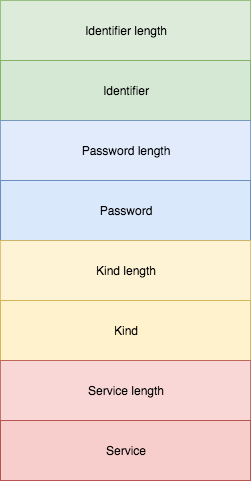
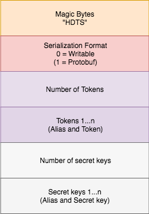

= Hadoop Token File Utils

Hadoop has the concept of Delegation Tokens. These can be used as a substitute for Kerberos tickets to authenticate against a service.

In Hadoop these are implemented as versions of a more generic `Token` class.
These Tokens can be obtained from the target services by (usually) presenting a Kerberos ticket.

Tokens can be serialized to a file and contain these pieces of information when serialized:

* Identifier
* Password
* Kind
* Service

The different kinds of Tokens might contain extra information. The HDFS Delegation Token for example includes these extra fields (these are transported in the Identifier):

* Owner
* Renewer
* Real user

== Use-case

So we have a bunch of (Delegation) Tokens and we need to store them, what to do?
Hadoop's `Credentials` class has methods to read and write Tokens to a _Token Storage File_.

It may be necessary to interact with those files.
One use-case is when you run an Oozie job which fetches Delegation Tokens for you and places them in a Token Storage file.
If you then want to use the Python HDFS Client to access WebHDFS you need to extract a single token from this file.

== Serialization

Tokens from the `Credentials` class can be stored in two differen formats.

The _legacy_ format uses Hadoop `Writables` and it's still the default in Hadoop 3.0 at least.
Then there's a new format based on Protocol Buffers which has been introduced in https://issues.apache.org/jira/browse/HADOOP-12563[Hadoop 3]

Hadoop 3 also introduced a tool `hadoop dtutil` that can be used to interact with those Token Storage Files but that's not available in Hadoop 2.

=== Writable

This is how a single Token is serialized:

And this is how the structure looks for a Token File:

=== Protobuf

Protobuf shares the first two fields with the Writable form (Magic Bytes and Serialization Format ("1" in this case) and then comes the Protocol Buffer serialized data which follows this schema:

.A single Token
[source,protobuf]
----
message TokenProto {
  required bytes identifier = 1;
  required bytes password = 2;
  required string kind = 3;
  required string service = 4;
}
----

.A Credentials File
[source,protobuf]
----
message CredentialsKVProto {
  required string alias = 1;
  optional hadoop.common.TokenProto token = 2;
  optional bytes secret = 3;
}

message CredentialsProto {
  repeated hadoop.common.CredentialsKVProto tokens = 1;
  repeated hadoop.common.CredentialsKVProto secrets = 2;
}
----

== This project

This project contains two classes to list all Tokens in a file or to retrieve a Token by its kind.

There is currently no API to get a Token by its alias. I have created https://issues.apache.org/jira/browse/HADOOP-15687[HADOOP-15687] to change this.

=== How to use

You build this class and then you can use these commands:

[source,bash]
----
hadoop jar hadoop-token-file-utils-1.0-SNAPSHOT.jar com.opencore.DelegationTokenLister token_test
hadoop jar hadoop-token-file-utils-1.0-SNAPSHOT.jar com.opencore.DelegationTokenReader token_test HDFS_DELEGATION_TOKEN
----

== PySpark

If you need to read a Token File from within PySpark you can use a code snippet like this:

[source,python]
----
def _read_delegation_token_file(tokenfile, kind):
    from pyspark import SparkContext

    sc : SparkContext = SparkContext.getOrCreate()

    file = sc._gateway.jvm.java.io.File(tokenfile)
    Credentials = sc._gateway.jvm.org.apache.hadoop.security.Credentials()

    credentials = Credentials.readTokenStorageFile(file, None)
    for token in credentials.getAllTokens().iterator():
        if str(token.getKind()) == kind:
            return token.encodeToUrlString()
----
